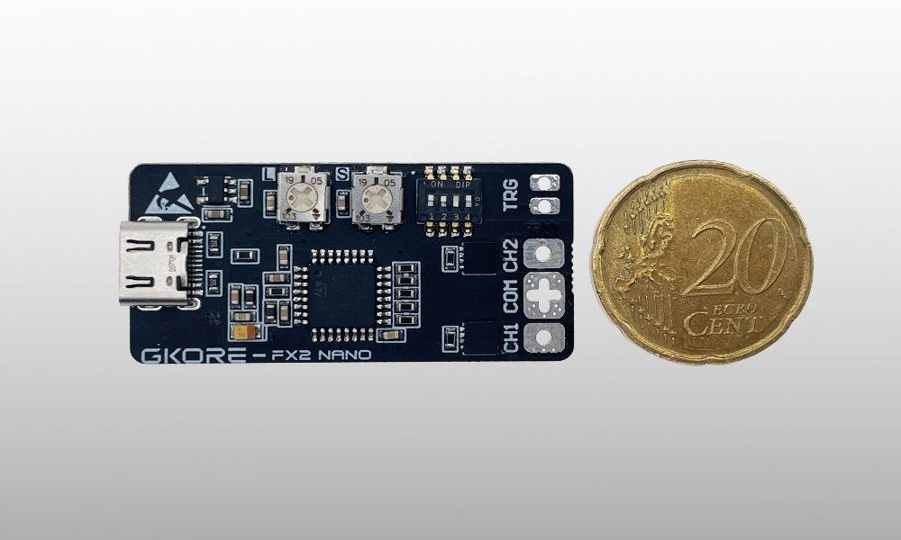
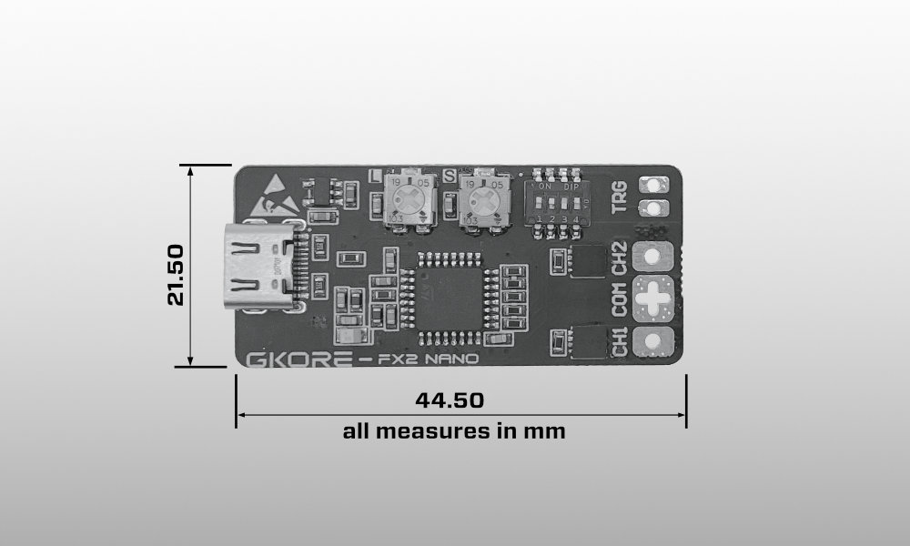
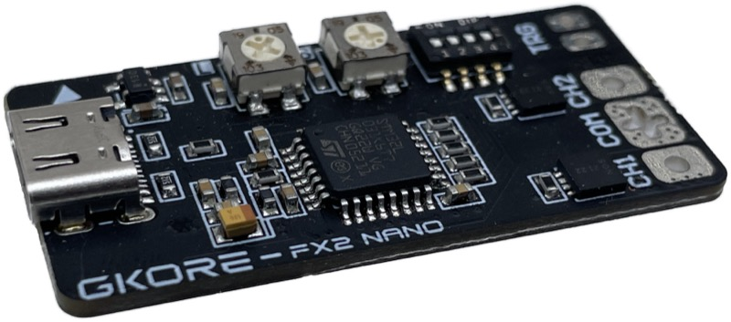

# GKORE FX2 nano - 2 channel LED Effect Controller

## Introduction

**GKORE FX2 nano** – the very small 2-channel effect controller for flexible and powerful LED lighting. Our little controller is perfect for your own DIY LED fixtures and practicals such as oil lamps or flashlights, where space is crucial.

Developed with film and movie usage in mind, this little buddy runs 2x 2A channels at flicker-free 30kHz and fine-tuned 10-bit dimming resolution without any hassle. We already provide some standard presets for a ready-to-go setup such as fire, blink and fade.

The integrated trigger input enables easy activation of the set effects or brightness, so that you can realize dynamic and interactive lighting concepts, or activate the GKORE FX2 nano on-cue.

Control any 5V based constant voltage [LED strip](https://www.cineleds.com/led-lighting/led-strips?p=1&properties=c5854fa51658465f83cc1c6ac22fd47f) (no digital) or LED lighting modules, like our [GKORE BAR2x3](https://www.cineleds.com/led-lighting/led-modules?p=1&properties=c5854fa51658465f83cc1c6ac22fd47f).

With our OpenSource license, you can freely modify and expand the software. Whether you're a developer, an enthusiast, or a business, this controller gives you complete control over your LED installations.

## Features

- **Flexible Configuration**: Supports a variety of LED strips (5V, non digital) and modules (CCT, 2 channels)
- **Easy Integration**: USB-C connector, 2 smooth running potentiometer and a 4-way DIP switch
	- 2 potentiometer: brightness and effect speed control
	- DIP switch: select your effect or function
		- DIP 1 / 2
			- 00 - CCT Dimming
			- 01 - BLINK 50/50
			- 10 - Flame Effect
			- 11 - FADE 50/50
		- DIP 3
			- Trigger OFF:Disabled / ON:Enabled
		- DIP 4
			- 2 single channel control
- **High Performance**: 30kHz PWM flicker-free, 10bit dim resolution (1024 steps)
- **Scalable**: Suitable for small DIY projects
- **Size**: 44.50mm x 21.50mm x 4.00mm
- **MCU / System**: STM32L031K6T7, 32MHz, 32kB Flash, LQFP-32
- **Debugging Ports**: back side: SWDIO, SWCLK, 3.3V, GND, NRST

## User Manual

Please download the manual here -> [Manual & Datasheet, 1.6MB PDF](https://gko.re/assets/manuals/fx2_nano/240624-manual-fx2-nano-v1.0_ENG.pdf)

## Where to buy the hardware?

Purchase our LED Controller directly from our [cineleds.com](https://www.cineleds.com) and start your project today!

---

### License

This project is licensed under the [MIT License](https://opensource.org/licenses/MIT).

---

SEO tags: OpenSource LED Controller, DIY LED control, CCT LED, LED Controller, OpenSource Hardware, flicker-free, practicals, LED fixtures, STM32, STM32, STM32L031K6T7
